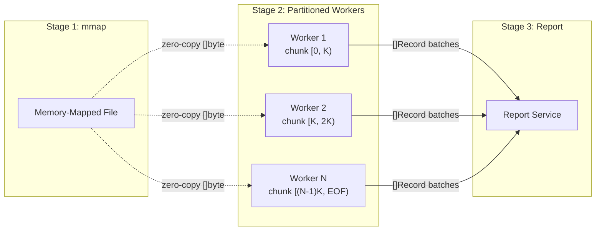

<p align="center">
  
  <h3 align="center">Tango</h3>
  <p align="center">Fast, concurrent access log analyzer</p>
</p>

---

<p align="center">
  <a href="https://github.com/roma-glushko/tango/actions"></a>
  <a href="https://snapcraft.io/tango"></a>
  <a href="https://github.com/roma-glushko/tango/blob/master/LICENSE"></a>
</p>

<p align="center">
  
</p>

Tango is a CLI tool that turns raw server access logs into actionable reports. It uses memory-mapped I/O and a partitioned parallel pipeline to process large log files across all available CPU cores, reaching **1M+ lines/sec** on commodity hardware.

## Installation

### macOS

```bash
brew tap roma-glushko/tango
brew install roma-glushko/tango/tango
```

### Linux

Available via [Snapcraft](https://snapcraft.io/tango) on Ubuntu, Debian, Fedora, Arch, and [other distros](https://snapcraft.io/tango).

```bash
sudo snap install tango
```

### Windows

```bash
scoop bucket add tango https://github.com/roma-glushko/scoop-tango.git
scoop install tango
```

## Quick Start

```bash
# Generate a custom filtered report
tango custom -l access.log -r report.csv

# Use 10 workers for faster processing
tango --workers 10 custom -l access.log -r report.csv

# Filter by IP and time range
tango --keep-ip-filter "8.8.8.8" \
      --keep-time-filter "2024-01-15 00:00:00 -0500" \
      --keep-time-filter "2024-01-15 23:59:59 -0500" \
      custom -l access.log -r report.csv
```

## Reports

### Custom Report

Filter and export raw log entries matching your criteria.

```bash
tango custom -l access.log -r custom.csv
```

### Geo Report

Map IPs to countries, cities, and continents using MaxMind GeoLite2.

```bash
tango geo -l access.log -r geo.csv
```

Requires the MaxMind database — install it with `tango geo-lib` (see [Geo Lib](#geo-lib)).

<details>
<summary>Example output</summary>

| IP | Country | City | Continent | Sample Request | Browser Agent | Count of Requests |
|---|---|---|---|---|---|---|
| 46.229.173.68 | United States | Ashburn | North America | /robots.txt | Googlebot/2.1 | 362 |
| 178.154.171.62 | Russia | | Europe | / | YandexBot/3.0 | 34 |

</details>

### Browser Report

Break down traffic by browser, crawler, and user agent.

```bash
tango browser -l access.log -r browser.csv
```

<details>
<summary>Example output</summary>

| Category | Browser | Requests | Bandwidth | Sample URL | User Agents |
|---|---|---|---|---|---|
| Crawlers | bingbot | 629 | 28.8 MB | /products | bingbot/2.0 |
| Chrome | Chrome | 131998 | 1.3 GB | /bags?p=3 | Chrome/79.0, Chrome/78.0 |

</details>

### Request Report

Aggregate requests by URL and response code.

```bash
tango request -l access.log -r request.csv
```

<details>
<summary>Example output</summary>

| Path | Requests | Response Code | Referer URLs |
|---|---|---|---|
| /media/catalog/product/bag.jpg | 20 | 200 | /black-bag |
| /test321 | 1 | 404 | / |

</details>

### Pace Report

Track request rates per minute/hour by IP.

```bash
tango pace -l access.log -r pace.csv
```

### Journey Report

Visualize visitor navigation paths as an HTML report.

```bash
tango journey -l access.log -r journey.html
```

## Filters

All filters are global flags placed **before** the subcommand.

| Flag | Description | Example |
|---|---|---|
| `--ip-filter` | Exclude IPs | `--ip-filter "127.0.0.1"` |
| `--keep-ip-filter` | Keep only matching IPs | `--keep-ip-filter "8.8.8.8"` |
| `--uri-filter` | Exclude URIs | `--uri-filter "/health"` |
| `--keep-uri-filter` | Keep only matching URIs | `--keep-uri-filter "/api/"` |
| `--keep-time-filter` | Keep time range (start, end) | `--keep-time-filter "2024-01-15 00:00:00 -0500" --keep-time-filter "2024-01-15 12:00:00 -0500"` |
| `--ua-filter` | Exclude user agents | `--ua-filter "bot"` |
| `--keep-ua-filter` | Keep only matching user agents | `--keep-ua-filter "Chrome"` |
| `--asset-filter` | Exclude static asset paths | `--asset-filter "/static/"` |
| `--system-ips` | Mark proxy/CDN IPs for stripping | `--system-ips "151.101.0.0/16"` |

## Pipeline Architecture

Tango memory-maps the log file and partitions it across N workers. Each worker independently parses, filters, and streams results.



Each worker gets a slice of the mmap'd file at newline boundaries. Workers parse `[]byte` directly from mapped memory, apply IP stripping and filters, then send batched results to the report service. Aggregating reports (browser, geo, request, pace) build in-memory maps; custom reports write directly to CSV.

### Pipeline Options

| Flag | Default | Description |
|---|---|---|
| `--workers, -w` | Number of CPUs | Parallel workers for log processing |
| `--write-buffer-size` | 256KB | Buffer size for writing reports |
| `--log-format` | `apache-combined` | Log format (`apache-combined`, `apache-common`) |
| `--cpu-profile` | | Write CPU profile to file for performance analysis |

## Config File

Save common options in `.tango.yaml` in your working directory:

```yaml
"asset-filter":
  - "/pub/static/"
  - "/pub/media/"
  - "/static/"
"ip-filter":
  - "127.0.0.1"
"system-ips":
  - "151.101.0.0/16"
  - "23.235.32.0/20"
```

## Geo Lib

Tango uses the MaxMind GeoLite2-City database for geo reports.

```bash
# Install the database
tango geo-lib

# Update an existing installation
tango geo-lib --update
```

Generate credentials at [MaxMind](https://www.maxmind.com/en/accounts/current/license-key). The database is stored at `~/.tango/GeoLite2-City.mmdb`.

## License

[Apache 2.0](LICENSE)
